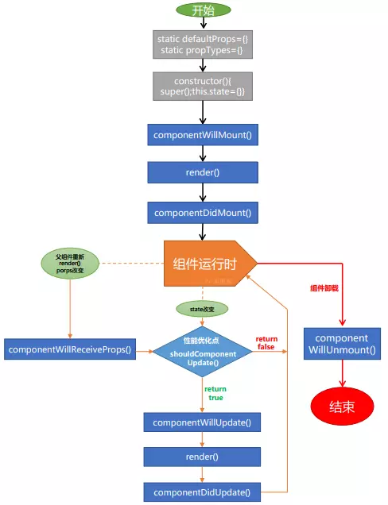

# 2019InterviewSummary

## 2019 年面试总结

### this 变量提升 箭头函数 原型链
   1. this <br>
      Javascript解释器和执行上下文 <br>
      Javascript是一种脚本语言，这意味着代码执行中没有编译步骤。解释器读取代码并逐行执行。正在执行该行的环境（或范围）称为“执行上下文”。Javascript运行时维护这些执行上下文的堆栈，并且当前正在执行存在于该堆栈顶部的执行上下文。每次执行上下文更改时，“this”引用的对象都会更改。<br>
      - “this”指的是全局对象<br>
         默认情况下，执行的执行上下文是全局的，这意味着如果代码作为简单函数调用的一部分执行，则“this”指的是全局对象。“window”对象是浏览器中的全局对象，在Node.JS环境中，一个特殊对象“global”将是“this”的值。<br>
         ```javascript
         function foo(){
            console.log(this === window);
         }
         foo(); // true;
         console.log(this === window); //true
         // IIFE(立即执行函数)
         (function(){
            console.log(this === window);
         })();  // true
         ```
         如果为任何函数启用了严格模式，那么“this”的值将是“undefined”，如在严格模式下，global对象是指未定义的，而不是windows对象。<br>
         ```javascript
         function foo(){
            'use strict';
            console.log(this === window);
         }
         foo();  // false
         // 在控制台上打印为false，因为在“严格模式”中，全局执行上下文中的“this”值未定义。
         ```
      - “this”指的是新实例<br>
         当使用“new”关键字调用函数时，该函数称为构造函数并返回一个新实例。在这种情况下，“this”的值指的是新创建的实例。
         ```javascript
         function Person(fn, ln) {
            this.fname = fn; this.lname = ln;
            this.displayName = function() {
               console.log(`Name: ${this.fname} ${this.lname}`);
            }
         }
         let person = new Person("tom", "ha");
         person.displayName();  // Name: tom ha
         let person2 = new Person("xx", "ss");
         person2.displayName(); // Name: xx ss
         ```
      - “this”指的是调用者对象（父对象）<br>
         在Javascript中，对象的属性可以是方法或简单值。调用Object的方法时，“this”指的是包含被调用方法的对象。
         ```javascript
         function foo() {
            'use strict';
            console.log(this);
            console.log(this === window);
         }
         let user = {
            num: 10,
            foo: foo,
            foo1: function() {
               console.log(this);
               console.log(this === window);
            }
         }
         user.foo(); // {num:10,foo: f, foo1: f} false  此处this为user
         let fun1 = user.foo1;
         fun1(); // Window{.....}  true  普通函数调用 this为全局变量window;
         user.foo1();  // {num:10, foo: f, foo1: f} false 此处this为user;
         ```
      - “this”通过call，apply方法改变<br>
         javascript中的函数也是一种特殊类型的对象。每个函数都有调用(call)，绑定(bind)和应用(apply)方法。这些方法可用于将“this”的自定义值设置为函数的执行上下文。
         ```javascript
         function Person(fn, ln) {
            this.fname = fn; this.lname = ln;
            this.displayName = function() {
               console.log(`Name: ${this.fname} ${this.lname}`);
            }
         }
         let person = new Person("tom", "a");
         person.displayName(); // Name: tom a;
         let person2 = new Person("jack", "b");
         person2.displayName(); // Name: jack b;
         // call和apply方法之间的唯一区别是参数的传递方式。在apply的情况下，第二个参数是一个参数数组，在call方法的情况下，参数是单独传递的。
         person.displayName.call(person2, 11); // Name: jack b;
         person.displayName.apply(person2, [11]); //Name: jack b;
         var xx = person.displayName.bind(person2);
         xx(); // Name: jack b;
         ```
      - “this” 箭头函数中 this with fat arrow function<br>
         当使用胖箭头(fat来源 ->细箭头 =>胖箭头; 实际就是我们说的箭头函数)时，它不会为“this”创建新值。“this”继续引用它所指的同一个对象，在函数之外。<br>
         在箭头函数中，this与封闭词法环境的this保持一致。在全局代码中，它将被设置为全局对象：
         ```javascript
         var globalObject = this;
         var foo = (() => this);
         console.log(foo() === globalObject); // true
         // 作为对象的一个方法调用
         var obj = {foo: foo};
         console.log(obj.foo() === globalObject); // true
         // 尝试使用call来设定this
         console.log(foo.call(obj) === globalObject); // true
         // 尝试使用bind来设定this
         foo = foo.bind(obj);
         console.log(foo() === globalObject); // true
         ```
         无论如何，foo 的 this 被设置为他被创建时的环境（在上面的例子中，就是全局对象）。这同样适用于在其他函数内创建的箭头函数：这些箭头函数的this被设置为封闭的词法环境的。<br>
         ```javascript
         // 创建一个含有bar方法的obj对象，
         // bar返回一个函数，这个函数返回this，
         // 这个返回的函数是以箭头函数创建的，
         // 所以它的this被永久绑定到了它外层函数的this。
         // bar的值可以在调用中设置，这反过来又设置了返回函数的值。
         var obj = {
            bar: function() {
               var x = (() => this);
               return x;
            }
         };
         // 作为obj对象的一个方法来调用bar，把它的this绑定到obj。
         // 将返回的函数的引用赋值给fn。
         var fn = obj.bar();
         // 直接调用fn而不设置this，
         // 通常(即不使用箭头函数的情况)默认为全局对象
         // 若在严格模式则为undefined
         console.log(fn() === obj); // true
         // 但是注意，如果你只是引用obj的方法，
         // 而没有调用它
         var fn2 = obj.bar;
         // 那么调用箭头函数后，this指向window，因为它从 bar 继承了this。
         console.log(fn2()() == window); // true
         ```
      * 总结<br>
         * 默认情况下，“this”指的是全局对象，在NodeJS的情况下是全局的，在浏览器的情况下是窗口对象
         * 当一个方法被称为对象的属性时，那么“this”指的是父对象
         * 当使用“new”运算符调用函数时，“this”指的是新创建的实例。
         * 当使用call和apply方法调用函数时，“this”指的是作为call或apply方法的第一个参数传递的值。
         * 箭头函数不创建this新值 定义时就得到this的指向
         * this在运行时确定
      <br>
   2. 变量提升 <br>
      js只有函数作用域 没有块级作用域
      let const 用暂时性死区实现块级作用域 
   3. 箭头函数 <br>
      箭头函数表达式的语法比函数表达式更简洁，并且没有自己的this，arguments，super或 new.target。这些函数表达式更适用于那些本来需要匿名函数的地方，并且它们不能用作构造函数。
      https://developer.mozilla.org/zh-CN/docs/Web/JavaScript/Reference/Functions/Arrow_functions<br>
      箭头函数不会创建自己的this,它只会从自己的作用域链的上一层继承this。<br>
      由于 箭头函数没有自己的this指针，通过 call() 或 apply() 方法调用一个函数时，只能传递参数（不能绑定this---译者注），他们的第一个参数会被忽略。（这种现象对于bind方法同样成立---译者注）<br>
      箭头函数不绑定Arguments 对象。因此，在本示例中，arguments只是引用了封闭作用域内的arguments:
      ```javascript
      var arguments = [1, 2, 3];
      var arr = () => arguments[0];
      arr(); // 1
      function foo(n) {
         var f = () => arguments[0] + n; // 隐式绑定 foo 函数的 arguments 对象. arguments[0] 是 n
         return f();
      }
      foo(1); // 2
      ```
      如上所述，箭头函数表达式对非方法函数是最合适的。让我们看看当我们试着把它们作为方法时发生了什么。
      ```javascript
      'use strict';
      var obj = {
         i: 10,
         b: () => console.log(this.i, this),
         c: function() {
            console.log( this.i, this)
         }
      }
      obj.b(); 
      // undefined
      obj.c(); 
      // 10, Object {...}
      ```
      箭头函数没有定义this绑定。另一个涉及Object.defineProperty()的示例：
      ```javascript
      'use strict';
      var obj = {
         a: 10
      };
      Object.defineProperty(obj, "b", {
         get: () => {
            console.log(this.a, typeof this.a, this);
            return this.a+10; 
            // 代表全局对象 'Window', 因此 'this.a' 返回 'undefined'
         }
      });
      obj.b; // undefined   "undefined"   Window {postMessage: ƒ, blur: ƒ, focus: ƒ, close: ƒ, frames: Window, …}
      ```
   4. 原型链  class <br>
      - class<br>
         https://developer.mozilla.org/zh-CN/docs/Web/JavaScript/Reference/Classes<br>
         类实际上是个“特殊的函数”，就像你能够定义的函数表达式和函数声明一样，类语法有两个组成部分：类表达式和类声明。<br>
         函数声明和类声明之间的一个重要区别是函数声明会提升，类声明不会。你首先需要声明你的类，然后访问它，否则像下面的代码会抛出一个ReferenceError：
         ```javascript
         let p = new Per(); // ReferenceError
         class per() {  // 类声明
            constructor(height, width){
               this.height = height;
               this.width = width;
            }
         }
         // 类表达式
         /* 匿名类 */ 
         let Rectangle = class {
            constructor(height, width) {
               this.height = height;
               this.width = width;
            }
         };
         /* 命名的类 */ 
         let Rectangle = class Rectangle {
            constructor(height, width) {
               this.height = height;
               this.width = width;
            }
         };
         ```
      //TODO 完善 <br>
      //原型链继承 https://blog.csdn.net/zhuanyemanong/article/details/80325387


### vue react 小程序 生命周期 store 相关

1. vue 生命周期 <br>

   1. init 阶段 <br>
      beforeCreate created
   2. compile create 阶段 <br>
      beforeMount mounted
   3. mounted 阶段 <br>
      beforeUpdate updated
   4. destroy 阶段 <br>
      beforeDestroy destroyed

   <div align="center"> </div>

2. react 生命周期 <br>
   1. componentWillMount();
   2. render();
   3. componentDidMount();
   4. componentWillReceiveProps();
   5. shouldComponentUpdate();
   6. componentWillUpdate();
   7. render();
   8. componentDidUpdate();
   9. componentWillUnmount();
   <div align="center"> </div>

3. 小程序 生命周期<br>
   1. onLoad();
   2. onShow();
   3. onReady();
   4. onHide();
   5. onShow();
   6. onUnload();
      <div align="center"> </div><br>
   - 组件生命周期
      ```javascript
      Component({
         lifetimes: {
            attached() {
               // 在组件实例进入页面节点树时执行
            },
            detached() {
               // 在组件实例被从页面节点树移除时执行
            },
            ready() {}, //在组件在视图层布局完成后执行
            moved() {}, //在组件实例被移动到节点树另一个位置时执行
            error(e) {}, //每当组件方法抛出错误时执行
         },
         // 以下是旧式的定义方式，可以保持对 <2.2.3 版本基础库的兼容
         attached() {},
         detached() {},
         // ...
      })
      ```
   - 登录流程
      <div align="center"> </div><br>

4. vuex <br>
   <div align="center"> </div>

   ```javascript
   // 一段busy后台的代码示例
   import Vue from "vue";
   import Vuex from "vuex";
   import xblmessage from "./module/xblmessage";
   import * as API from "@/api/xblmessage";
   Vue.use(Vuex);
   export default new Vuex.Store({
      state: {
         list: [],
      },
      mutations: {
         saveList(state, list){
            state.list = list;
         }
      },
      actions: {
         fetchList({state, commit}, params) {
            API.delXBLMessage(params)
               .then(() => {
                  const newList = state.list.filter(item => item._id !== params.id);
                  commit("saveList", newList);
               })
               .catch(e => {
                  return Error(e);
               });
         }
      },
      modules: {
         xblmessage,
      }
   });
   ```
5. dva <br>
   https://dvajs.com/guide/concepts.html#%E6%95%B0%E6%8D%AE%E6%B5%81%E5%90%91 <br>


### 双向数据绑定

1. 双向数据绑定 <br>
   双向数据绑定指的是将对象属性变化绑定到UI，或者反之。换句话说，如果我们有一个拥有name属性的user对象，当我们给user.name赋予一个新值是UI也会相应的显示新的名字。同样的，如果UI包括了一个输入字段用来输入用户名，输入一个新的值会导致user对象中的那么属性发生变化。<br>
   双向数据绑定底层的思想非常的基本，它可以被压缩成为三个步骤：<br>
   1. 我们需要一个方法来识别哪个UI元素被绑定了相应的属性
   2. 我们需要监视属性和UI元素的变化
   3. 我们需要将所有变化传播到绑定的对象和元素<br>

   虽然实现的方法有很多，但是最简单也是最有效的途径是使用发布者-订阅者模式。思想很简单：<br>
   我们可以使用自定义的data属性在HTML代码中指明绑定。所有绑定起来的JavaScript对象以及DOM元素都将“订阅”一个发布者对象。任何时候如果JavaScript对象或者一个HTML输入字段被侦测到发生了变化，我们将代理事件到发布者-订阅者模式，这会反过来将变化广播并传播到所有绑定的对象和元素。
   - 实现发布-订阅模式  /mvvm/jq.html      /mvvm/nojq.html
   * 脏值检查 <br>
      angular.js 是通过脏值检测的方式比对数据是否有变更，来决定是否更新视图，最简单的方式就是通过 setInterval() 定时轮询检测数据变动，当然Google不会这么low，angular只有在指定的事件触发时进入脏值检测，大致如下：<br>
      * DOM事件，譬如用户输入文本，点击按钮等。( ng-click )
      * XHR响应事件 ( $http )
      * 浏览器Location变更事件 ( $location )
      * Timer事件( $timeout , $interval )
      * 执行 $digest() 或 $apply()
   * 数据劫持<br>
      vue.js 则是采用数据劫持结合发布者-订阅者模式的方式，通过Object.defineProperty()来劫持各个属性的setter，getter，在数据变动时发布消息给订阅者，触发相应的监听回调。<br>
      已经了解到vue是通过数据劫持的方式来做数据绑定的，其中最核心的方法便是通过Object.defineProperty()来实现对属性的劫持，达到监听数据变动的目的，无疑这个方法是本文中最重要、最基础的内容之一，如果不熟悉defineProperty，猛戳[[MDN]](https://developer.mozilla.org/zh-CN/docs/Web/JavaScript/Reference/Global_Objects/Object/defineProperty)<br>
      1. 实现一个数据监听器Observer，能够对数据对象的所有属性进行监听，如有变动可拿到最新值并通知订阅者
      2. 实现一个指令解析器Compile，对每个元素节点的指令进行扫描和解析，根据指令模板替换数据，以及绑定相应的更新函数
      3. 实现一个Watcher，作为连接Observer和Compile的桥梁，能够订阅并收到每个属性变动的通知，执行指令绑定的相应回调函数，从而更新视图
      4. mvvm入口函数，整合以上三者<br>
      流程如图
      <div align="center"> </div>
      相关代码 /mvvm/vue_dd.html


   